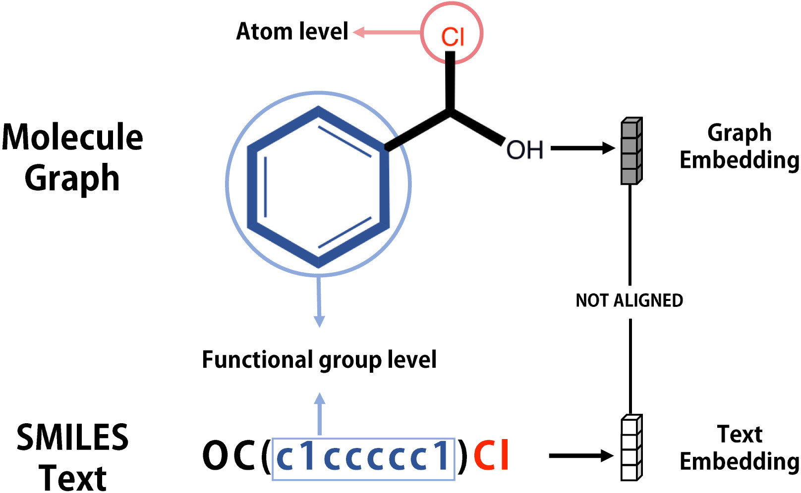
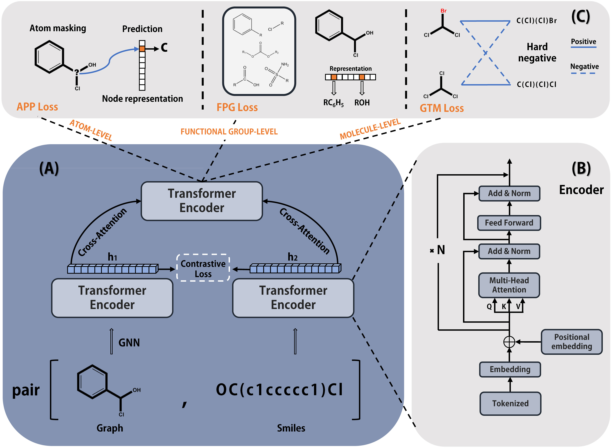
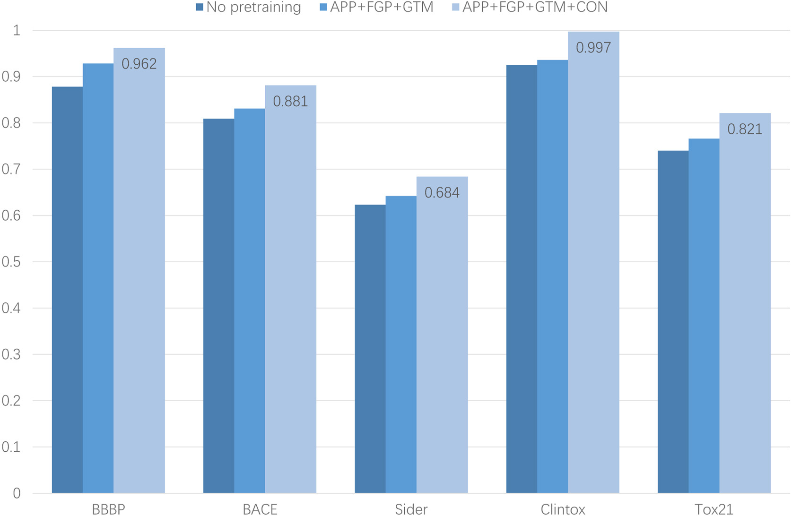
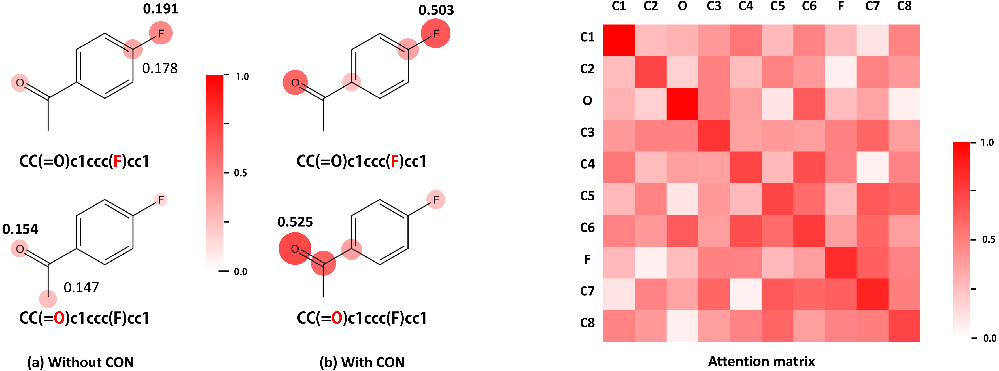

# Boosting the performance of molecular property prediction via graph-text alignment and multi-granularity representation enhancement

**Zhuoran Zhao, Qing Zhou, Chengkai Wu, Renbin Su, and Weihong Xiong**<br>
*Journal of Molecular Graphics and Modelling*, Volume 132, 108843, 2024

[[Paper](https://doi.org/10.1016/j.jmgm.2024.108843)]
[[PubMed](https://pubmed.ncbi.nlm.nih.gov/39173218/)]
[[Citation](#citation)]

> Official implementation of the graph-text molecular representation method
> proposed in the paper, with cross-modal alignment and chemistry-aware,
> multi-granularity pretraining.

## Overview

Molecules are commonly represented as either SMILES text or molecular graphs,
but embeddings learned independently from these two modalities are not
naturally aligned. The proposed method aligns graph and text features through
contrastive learning, fuses them with cross-attention, and enriches the learned
molecular representation with atom-, functional-group-, and molecule-level
pretraining objectives. The resulting representation is transferred to
downstream molecular property prediction tasks.

The paper reports improved performance over the compared state-of-the-art
methods while using less pretraining data.

### Highlights

- **Aligned multimodal representations.** Contrastive learning reduces the
  embedding gap between paired molecular graphs and SMILES sequences.
- **Deep graph-text interaction.** Cross-attention exchanges complementary
  structural and sequential information instead of simply concatenating the
  two modalities.
- **Chemistry-aware pretraining.** Atom-, functional-group-, and molecule-level
  objectives inject domain knowledge at complementary scales.
- **Consistent downstream gains.** The complete pretraining objective performs
  best across all five classification benchmarks in the paper's ablation.

## Quick start

The following CPU-only example runs the complete workflow on the small dataset
included in this repository:

1. construct paired molecular graph and SMILES inputs;
2. perform one graph-text pretraining epoch;
3. transfer the pretrained encoders to a binary property predictor;
4. fine-tune the prediction head and evaluate the test split.

```bash
python -m pip install -e ".[train]"
python examples/end_to_end_quickstart.py
```

A successful run ends with output similar to:

```text
End-to-end quick start completed on CPU
  pretraining molecules: 8
  train/valid/test:      5/2/2
  example test ROC-AUC:  1.0000
```

This bounded example verifies that preprocessing, pretraining, representation
transfer, fine-tuning, and evaluation work together. The paper experiments use
the full datasets and settings described below.

## Why graph-text alignment?

<p align="center">
  
</p>

The same molecule contains corresponding atom- and functional-group-level
information in both its graph and SMILES forms. However, independently learned
graph and text embeddings can remain separated in the representation space.
The method uses a contrastive objective to bring paired representations
together and cross-attention to exchange information between the two
modalities.

*Figure 1 from Zhao et al. (2024). Source: [DOI
10.1016/j.jmgm.2024.108843](https://doi.org/10.1016/j.jmgm.2024.108843).
© 2024 Elsevier Inc.; reproduced here by author request.*

## Architecture

<p align="center">
  
</p>

The architecture contains a graph encoder, a SMILES Transformer, graph-text
contrastive alignment, and a multimodal cross-attention module. The pretraining
objectives operate at three molecular granularities:

- **APP — Atom Property Prediction:** learns local atom-level chemical
  information.
- **FGP — Functional Group Prediction:** injects functional-group-level domain
  knowledge.
- **GTM — Graph-Text Matching:** learns molecule-level correspondence between
  graph and SMILES views.
- **CON — Contrastive Learning:** aligns paired graph and text representations
  in the embedding space.

*Figure 2 from Zhao et al. (2024): (A) graph and SMILES encoders with
contrastive alignment and cross-attention; (B) the Transformer encoder block;
and (C) the multi-granularity pretraining objectives. Source: [Journal of
Molecular Graphics and Modelling, DOI
10.1016/j.jmgm.2024.108843](https://doi.org/10.1016/j.jmgm.2024.108843).
© 2024 Elsevier Inc.; reproduced here by author request.*

## Original datasets

### Pretraining data

The model is pretrained with molecules from
[ChEMBL](https://www.ebi.ac.uk/chembl/). Each molecule is converted into two
paired views: a molecular graph for the graph encoder and a tokenized SMILES
sequence for the text encoder. Atom properties, functional groups, and
graph-text pairs provide supervision at complementary molecular scales.

| Source | Data role | Molecular views | Learning signals |
|---|---|---|---|
| ChEMBL | Unlabeled molecular pretraining | Graph + tokenized SMILES | APP + FGP + GTM + CON |

### Downstream benchmarks

The paper's classification experiments use five public MoleculeNet benchmarks.
The original dataset files and standard benchmark definitions are available
through [MoleculeNet](https://github.com/deepchem/moleculenet).

| Dataset | Molecular property | Tasks | Paper metric |
|---|---|---:|---|
| BBBP | Blood-brain barrier permeability | 1 | ROC–AUC ↑ |
| BACE | Inhibition of human β-secretase 1 | 1 | ROC–AUC ↑ |
| SIDER | Adverse drug reactions grouped by system organ class | 27 | ROC–AUC ↑ |
| ClinTox | Clinical toxicity and regulatory approval outcomes | 2 | ROC–AUC ↑ |
| Tox21 | Nuclear-receptor and stress-response toxicity assays | 12 | ROC–AUC ↑ |

The task counts make the benchmark scope explicit: BBBP and BACE are
single-task classification problems, whereas SIDER, ClinTox, and Tox21 test
multi-task molecular representations across heterogeneous biological endpoints.

## Training method

1. **Build paired molecular views.** Canonical SMILES strings are tokenized for
   the text branch and converted to atom-bond graphs for the graph branch.
2. **Encode each modality.** A pretrained GROVER encoder extracts graph
   representations, while a six-layer Transformer encodes the SMILES sequence.
3. **Apply multi-granularity pretraining.** APP, FGP, and GTM learn chemical
   information at the atom, functional-group, and molecule levels.
4. **Align and fuse graph and text.** The contrastive loss maximizes agreement
   between paired global representations, and cross-attention produces the
   joint multimodal representation.
5. **Fine-tune for molecular properties.** A task-specific prediction head is
   optimized on each labeled benchmark. Classification performance is measured
   with ROC–AUC, following the evaluation in the paper.

The paper-scale configuration represented by [`configs/pretrain.yaml`](configs/pretrain.yaml)
uses the following settings:

| Component | Setting |
|---|---|
| SMILES Transformer | 6 layers, 768 hidden dimensions, 12 attention heads |
| Maximum SMILES length | 201 tokens |
| Graph encoder | pretrained GROVER, frozen during graph-text pretraining |
| Cross-modal module | 6 unimodal layers, 6 multimodal layers, 8 attention heads |
| Batch size | 32 |
| Optimizer | Adam |
| Learning rate | 1 × 10⁻⁵ |
| Pretraining epochs | 50 |
| Random seed | 10 |

## Results reported in the paper

### Evaluation metric

**ROC–AUC (area under the receiver operating characteristic curve)** evaluates
how well a model ranks positive molecules above negative molecules across all
possible decision thresholds. A value of 0.5 corresponds to random ranking and
1.0 to perfect discrimination; **higher is better (↑)**. For multi-task
benchmarks, the reported score summarizes predictive quality across their
constituent endpoints.

Figure 3 compares three controlled variants: **no pretraining**,
**APP + FGP + GTM**, and the complete **APP + FGP + GTM + CON** objective. This
design isolates the contribution of chemistry-aware multi-granularity
pretraining and then measures the additional effect of graph-text contrastive
alignment.

<p align="center">
  
</p>

| Benchmark | Tasks | Complete objective | Paper-reported ROC–AUC ↑ |
|---|---:|---|---:|
| BBBP | 1 | APP + FGP + GTM + CON | **0.962** |
| BACE | 1 | APP + FGP + GTM + CON | **0.881** |
| SIDER | 27 | APP + FGP + GTM + CON | **0.684** |
| ClinTox | 2 | APP + FGP + GTM + CON | **0.997** |
| Tox21 | 12 | APP + FGP + GTM + CON | **0.821** |

*Values are the final-configuration ROC-AUC scores printed in Figure 3 of the
paper. © 2024 Elsevier Inc.; reproduced here by author request.*

### What the ablation demonstrates

- **The complete objective is consistently strongest.** Adding contrastive
  graph-text alignment to APP + FGP + GTM improves the result on every plotted
  benchmark, rather than benefiting only one property family.
- **The model is particularly strong on BBBP and ClinTox.** The full model reaches
  0.962 and 0.997 ROC–AUC, respectively, while also attaining 0.881 on BACE and
  0.821 on Tox21.
- **The result spans different levels of task complexity.** The same framework
  transfers from single-task endpoints to SIDER's 27 adverse-reaction labels
  and Tox21's 12 toxicity assays.

Because the datasets differ in size, label balance, and number of tasks, their
absolute ROC–AUC values should be interpreted within each benchmark. The key
cross-benchmark finding is the consistent ordering of the three controlled
pretraining variants.

### Representation analysis

Figure 6 visualizes how contrastive alignment changes the learned attention.
With the contrastive objective, the model places stronger weight on
corresponding chemically meaningful regions in the molecular graph and SMILES
sequence. The graph-text attention matrix further shows the learned interactions
between graph atoms and SMILES tokens.

<p align="center">
  
</p>

*Figure 6 from Zhao et al. (2024), showing the example without and with the
contrastive objective and its graph-text attention matrix. © 2024 Elsevier
Inc.; reproduced here by author request.*

## Full-data training

Python 3.9–3.12 is supported.

```bash
python -m pip install -e ".[train,test]"
pytest -q
```

Prepare ChEMBL molecules from a CSV containing a `smiles` column:

```bash
python scripts/prepare_pretrain_data.py \
  --input data/pretrain_data/CHEMBL_smiles.csv \
  --output-dir artifacts/pretrain \
  --num-shards 4
```

The same command can retrieve molecules through the ChEMBL web service when
`--input` is omitted:

```bash
python scripts/prepare_pretrain_data.py \
  --output-dir artifacts/pretrain \
  --max-molecules 12008 \
  --num-shards 4
```

Run graph-text pretraining with the paper-scale configuration:

```bash
python scripts/run_pretraining.py \
  --config configs/pretrain.yaml \
  --grover-checkpoint path/to/grover_large.pt
```

See the [preprocessing guide](docs/preprocessing.md),
[fine-tuning guide](docs/finetuning.md), and
[configuration reference](docs/configuration.md) for the complete workflow.

## Repository structure

```text
configs/       paper-scale and development configurations
gtpro/         public API, data, metrics, models, and training code
pretrain/      graph-text pretraining and alignment modules
scripts/       preprocessing, pretraining, fine-tuning, and evaluation entry points
tests/         unit and integration tests
docs/          method, dataset, environment, and reproducibility documentation
examples/      forward and molecular encoding examples
```

## Citation

```bibtex
@article{zhao2024graphtext,
  title   = {Boosting the performance of molecular property prediction via graph-text alignment and multi-granularity representation enhancement},
  author  = {Zhao, Zhuoran and Zhou, Qing and Wu, Chengkai and Su, Renbin and Xiong, Weihong},
  journal = {Journal of Molecular Graphics and Modelling},
  volume  = {132},
  pages   = {108843},
  year    = {2024},
  doi     = {10.1016/j.jmgm.2024.108843}
}
```

Additional citation metadata are available in [`CITATION.cff`](CITATION.cff).

## License and acknowledgements

Repository-authored engineering additions are released under the
[`LICENSE`](LICENSE). Bundled GROVER code retains its upstream MIT notice; see
[`LICENSE_SCOPE.md`](LICENSE_SCOPE.md) for file-level scope.

We acknowledge Tencent AI Lab and Chemprop contributors for the GROVER
implementation lineage, and the RDKit, PyTorch, scikit-learn, and scientific
Python communities.

See [`CONTRIBUTING.md`](CONTRIBUTING.md) for contribution guidelines.
