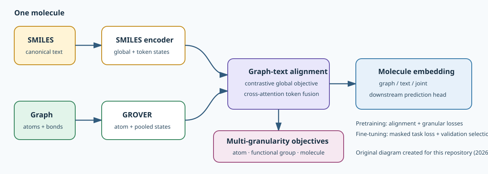

# Architecture and tensor flow

This is Figure 2 from the GTpro paper. Panel A shows graph/SMILES encoding,
contrastive alignment and bidirectional cross-attention; panel B expands the
Transformer encoder; panel C shows the atom-level APP, functional-group-level
FPG, and molecule-level GTM objectives. The figure is sourced from Zhao et al.
(2024), DOI `10.1016/j.jmgm.2024.108843`, © 2024 Elsevier Inc., and is
reproduced here by author request.

## Implementation-oriented map

The second diagram was created for this repository from the implemented data
flow. It complements the paper figure with the concrete package boundaries used
by the maintained code.

## Encoders

Canonical SMILES become token IDs `[B, S]`, with `[GLO]` at position zero and
`[PAD]` at padded positions. `K_BERT_WCL` applies learned token/position
embeddings and Transformer encoder layers. It returns all token states
`[B,S,D_text]`, a global state `[B,D_text]`, non-global token states
`[B,S-1,D_text]`, and molecule logits `[B,154]`.

RDKit converts the same canonical SMILES to GROVER graph components. The bundled
message-passing Transformer returns atom embeddings
`[1 + total_atoms,D_graph]`; row zero is padding. `encode_graph` uses atom scopes
`[B,2]` to mean-pool real atoms into `[B,D_graph]` molecule states and normalizes
the supported GROVER dict/tuple schemas in one place.

## Alignment and multi-granularity pretraining

CoCa projects graph and text states to a common dimension. Global graph/text
states receive a symmetric contrastive objective. Text token states attend to
graph atom states through cross-attention. Fused positions predict 15 atom
features only where the atom mask is true; the fused global position predicts
85 functional-group labels. The SMILES global state separately predicts 154
selected MACCS keys. The four weighted objectives are recorded independently
and summed for optimization.

## Downstream and inference flow

The downstream runner can expose graph `[B,D_graph]`, text `[B,D_text]`, or joint
`[B,D_graph+D_text]` representations. A two-layer prediction head emits `[B,T]`
logits. Classification uses masked BCE and optional recorded positive weights;
regression uses masked MSE. Validation selects the best checkpoint before a
single test evaluation.

`GTproEncoder` omits the prediction head and returns those representations
directly as float32. Its batching path reuses the same canonicalization,
tokenization, graph construction, pooling, device transfer, and strict
checkpoint architecture.

Detailed mask semantics and typed boundaries are in
[`model_interfaces.md`](model_interfaces.md).
